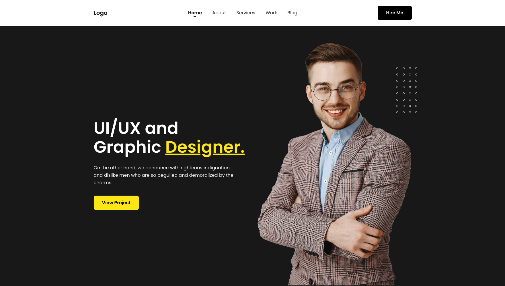

# [Echotemplate.com](https://echotemplate.com)
FREE UI & HTML Templates for Designer and Developer. Echotemplate is a place where a team of design & developers create beautiful templates. Visit [Echotemplate.com](https://echotemplate.com) for more updates.

# [Minimal Personal Portfolio HTML Template](https://www.echotemplate.com/templates/minimal-personal-portfolio-html-template)

> Minimal Personal Portfolio HTML Template based on bootstrap framework v4.5

This project is a bootstrap version [Minimal Personal Portfolio HTML Template](https://www.echotemplate.com/templates/minimal-personal-portfolio-html-template) designed with HTML & CSS.

Check the [Live Demo here](https://demo.echotemplate.com/minimal-personal-portfolio-html-template/).

## Credits
- Design by coded by [Zakir Soft](https://zakirsoft.com)

## License
The MIT License (MIT). Please see [License File](LICENSE.md) for more information.
